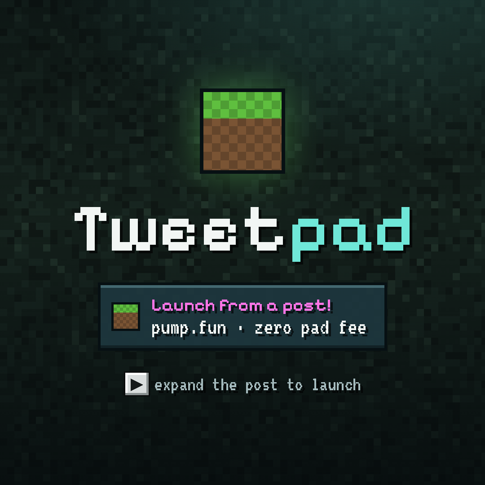

<p align="center">
  <picture>
    <source media="(prefers-color-scheme: dark)" srcset="docs/brand/lockup-dark.png">
    
  </picture>
</p>

<p align="center"><b>Launch a token without leaving the tweet.</b></p>

<p align="center"><a href="https://www.tweetpad.io">tweetpad.io</a> · <a href="https://github.com/cloutprotocol/tweetpad">github.com/cloutprotocol/tweetpad</a></p>

tweetpad is an X player card dressed as the 2012 bird app (or a pixel HUD, if you pick that skin). Expand the tweet, connect a Solana wallet, drop an image, pick a ticker,
press **Launch**. The coin goes live on pump.fun, gets listed on tweetpad, and has its own chart, live trades and a
shareable card that plays inside X again. No app to install and no tab to open.

> Launches are plain SOL pairs for now. Once the platform token exists, setting `QUOTE_MINT` pairs every new coin
> with it, so every trade on a tweetpad coin buys the platform token first. Coins already paired with `$JACK` (the
> earlier stand-in) keep their pair, and their creators can still claim `$JACK` fees.



## What it does

| | |
| --- | --- |
| **Launch** | Image (pick, drop or paste), name, ticker, a description of up to 140 characters, optional X / Telegram / website links, and a dev buy with a live estimate of the tokens it gets. One wallet approval. Live on pump.fun in seconds. |
| **Pairing** | "Pair with" on the form: SOL (default) or any coin launched on tweetpad, picked from a grid you can search by name, ticker or contract. The server checks pump.fun accepts it before building (`create_v2`). `QUOTE_MINT` sets the default pair. |
| **Feed** | A pad-wide timeline: "What's happening?" in 140 characters, with one tweetpad coin embedded as a card; $TICKERs link to their coins. Likes, retweets (they land on the retweeter's profile) and replies, with a 2012-style tweet view. |
| **Tokens** | Every coin launched here, with market cap, 1h move and the last day drawn faintly behind each row. New / Hot / Mcap, 24 at a time. |
| **Coin screen** | Candle chart, compact recent trades, live trades over a websocket, the creator (2012-style author card), copyable contract address, share card, and **posts**: tweet-sized comments (140 characters) signed in with the wallet. |
| **Inventory** | The hotbar holds your coins, then the newest. `1`–`9` opens them. |
| **More** | Profile, Games, Debug, About (version, network, $TP contract, contact) and Settings (skins) in one list. |
| **Profile** | Link your wallet to your X account with one tweet, see the coins you launched, claim creator rewards. |
| **Settings** | Skins: **2012** (default: blue bar, white cards, dark tab bar) or **Tweetcraft** (the pixel HUD). Saved per browser. |
| **Games** | Coming soon: a placeholder grid for now. |
| **Debug** | The original wallet-in-an-iframe probe: sign tests, environment, report, popup bridge. |

Keys: `C` wallet · `L` launch · `T` tokens · `F` feed · `M` more · `P` profile · `G` games · `A` about · `,` settings · `D` debug · `1`–`9` inventory · `H` chat · `Esc` back.

## How it works

```
X post ── player card (embed.html, sandboxed iframe) ──┬── wallet (Wallet Standard)
                                                       └── /api/* on Vercel ── Upstash Redis
                                                                  │
                         pump.fun IPFS · PumpPortal · pump SDK ───┤
                         DexScreener · GeckoTerminal · Solana RPC ┘
```

A launch, end to end:

1. **IPFS**: `/api/ipfs` checks the image bytes and pins image + metadata through pump.fun's IPFS endpoint
   (it answers servers, not browsers). Pinata is the fallback.
2. **Build**: the page makes a fresh mint keypair (it never leaves the page). `/api/create` builds the create
   transaction with pump.fun's SDK (paired) or PumpPortal (SOL), checks its signers and program, and records it as
   pending.
3. **Sign**: the wallet signs first (it may add instructions), then the mint signs the exact message the wallet returned.
4. **Send**: straight to Solana, then wait for confirmation.
5. **List**: `/api/launches` re-reads the transaction on chain (success, pump.fun program, payer, mint, pairing) before
   the coin goes on the list. A coin that was not built here cannot be listed.

### Things we learned the hard way

- **X's card iframe is sandboxed without `allow-forms`.** A `<form>` submit is dropped silently, with no `submit`
  event. Every action is a click handler.
- **Its origin can be opaque (`null`)**, so even our own API is cross-origin: every function answers CORS.
- **Wallets do reach the card on desktop**: Phantom and other Wallet Standard wallets register inside the frame.
  In the X mobile app there are no wallets, so the card offers "Open in Phantom / Solflare" instead.
- **ipfs.io rate-limits (429)**, so images go through `/api/image`, which races several gateways, resizes with sharp
  and caches forever (a CID never changes).
- **Solana v1 transactions exist now**: on-chain checks ask for `maxSupportedTransactionVersion: 1`.
- **Free reads only**: market data from DexScreener, candles and trades from GeckoTerminal, live trades from
  PumpPortal's websocket, X verification from the public tweet behind a link. No paid APIs.

### Profiles and X verification

Tweet a one-time code, paste the link, sign a message with the wallet. The server reads the public tweet
(X's syndication endpoint, no login or API key), checks the code and the date, and links `@handle` to the wallet.
Both halves are required, so nobody can claim someone else's wallet or handle.

## Layout

```
index.html             landing page, carries the X card tags
embed.html             the card app: markup only
preview.html           /preview: how each card looks in a post, from the live twitter:* tags
preview.png            the main X card image (source: scripts/preview.html)
site.webmanifest       app name and icons (wallet connect prompts, home screens)
assets/tweetpad.js     the card app (plain JS, no build step)
assets/tweetpad.css    layout and the Tweetcraft skin (pixel HUD)
assets/skin-2012.css   the default 2012 skin, layered over tweetpad.css
assets/brand/          app icon kit: favicons, # icon sizes, # glyphs
api/                   Vercel functions, one per route; _lib.js is shared and not a route
  ipfs · create · launches · market · chart · image · upload     launching, the token list, prices and charts
  card · card-image                                              share pages and their per-coin card images
  chat · social · reactions · profile · rewards                  chat, feed, posts, likes/retweets, profiles, creator fees
scripts/check.js       `npm run check`: syntax and wiring smoke test
scripts/preview.html   source for preview.png (render command inside)
scripts/lockup.html    source for the README header lockup (docs/brand/lockup-*.png)
docs/CHECKLIST.md      what's next: critical fixes, quick wins, quality of life
docs/brand/            large brand files: 1024px icon, token profile pictures
```

## Run it

```sh
npm install
vercel link                      # once
vercel integration add upstash   # Redis; then `vercel env pull`
npm run local                    # http://localhost:3000/embed.html
npm run check
```

Settings live in [`.env.example`](.env.example): `QUOTE_MINT` (pairing token; empty means SOL), `RPC_URL`, `PINATA_JWT`.

### Put it in a tweet

1. Deploy (`npm run deploy`) and point `index.html`'s `twitter:*` tags at your domain.
2. `embed.html` must not send `X-Frame-Options`; `vercel.json` sends `frame-ancestors` for X instead.
3. Post the domain. X caches cards per URL, so add `?v=2` after any change to the tags.
4. Share a single coin with `/c/<mint>`: its card opens straight to that coin.

## Safety notes

- Launches create real tokens on mainnet and cost real SOL. The card says so; the wallet shows the cost.
- The page never holds a user's keys. The only key it creates is the new coin's mint key, used once and discarded.
- Write endpoints are rate-limited per IP (Redis, fixed window).
- Fresh `*.vercel.app` domains get phishing warnings in MetaMask. Use your own domain before going public.

## License

[MIT](LICENSE). Build your own pad, pair it with your own token, have fun.
